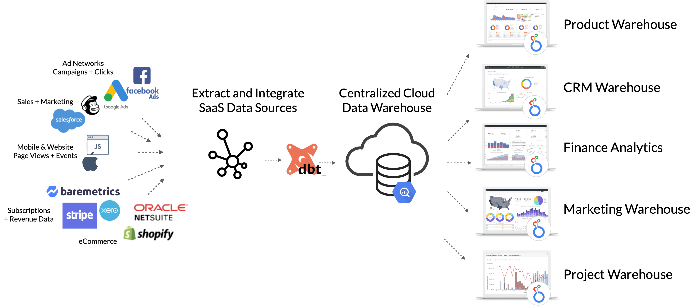

## Introduction

The RA Warehouse dbt framework is a set of data models, data transformations and data warehousing design patterns for use with dbt ("Data Build Tool"), an open-source data transformation and orchestration toolkit we use when modern data stacks for clients and for internal use. We've decided to open-source this framework to share our learnings and experience with the dbt and analytics engineering community, and to invite others to review, contribute and fork this repository.



* [What's New in the v1.2.0 release](whats_new_in_v_1_2_0.md)

You can read more about our work with dbt, Google BigQuery, Snowflake and other modern data stack technologies on our website and blog:

* [Rittman Analytics](https://rittmananalytics.com/home-index) homepage
* [Data Centralization](https://rittmananalytics.com/data-centralization) consulting packages
* [Rittman Analytics Blog dbt Posts](https://rittmananalytics.com/blog/tag/dbt)
* [Contact Us](https://rittmananalytics.com/home-index/#about-us)

## Why Did We Create This Framework?

[dbt](getdbt.com) is a toolkit that solves the problem of testing, repeatability and modularity of analysts code by bringing the principles of modern software development to the analysts' workflow. The RA Data Warehouse framework solves the problem of how to design your dbt transformations so that your project doesn't grind to a halt after you integrate your second, third, fourth data source because you need to combine identity across multiple systems, deduplicate multiple sources of customer data and make sure that numbers coming out of your BI tool still match with the numbers in your source systems.

* [Getting Started with dbt](https://rittmananalytics.com/getting-started-with-dbt) consulting packages
* [dbt Viewpoint](https://docs.getdbt.com/docs/about/viewpoint/)
* [dbtCloud](https://docs.getdbt.com/docs/dbt-cloud/cloud-overview) for scheduling and orchestrating dbt and the RA Data Warehouse

## Design Goals

1. To provide standards for our team on how to structure, model and transform data for analysis
2. To enable merging of customer, product, contact and other shared entity data with no single authoratitive source
3. To provide fast time-to-value on client projects by pre-building and pre-integrating common SaaS data sources
4. To pre-create derived analytics measures for individual and combinations of sources
5. To create a means of selecting sources and warehouses and have just those sources/warehouses loaded (and deployed for a customer)
6. To support use of multiple warehouse platforms and combinations of extract technologies while maintaining a single code base
7. To make it simpler to run data quality tests than to not, by defining these tests in-advance
8. To enable loading and integration of custom (customer app database) sources into the warehouse

[Introducing the RA Warehouse dbt Framework : How Rittman Analytics Does Data Centralization using dbt, Google BigQuery, Stitch and Looker](https://rittmananalytics.com/blog/2020/5/28/introducing-the-ra-warehouse-dbt-framework-how-rittman-analytics-does-data-centralization) on the Rittman Analytics blog talks more about the background to this package.

### Dimensional Model


### dbt Transformation Graph


## What Data Warehouse, Data Pipeline and Data Collection Technologies are Supported?

* Google BigQuery (Standard SQL)
* Snowflake Data Warehouse
* Stitch
* Fivetran
* Segment

## What SaaS Sources are Supported?

* Hubspot CRM (Stitch, Fivetran)
* Hubspot Marketing (Stitch)
* Harvest Timesheets (Stitch)
* Xero Accounting (Stitch)
* Salesforce CRM (Stitch)
* Stripe Payments (Stitch)
* Stripe Subscriptions (Segment)
* Asana Projects (Stitch)
* Jira Projects (Stitch)
* Mailchimp Email Marketing (Stitch)
* Segment Events and Pageviews (Segment)
* GCP Billing Exports
* Google Ads (Segment, Stitch)
* Facebook Ads (Segment, Stitch)
* Intercom Messaging (Stitch)
* Mixpanel Events (Stitch, Fivetran)
* Baremetrics Analytics (Segment)
* Custom data sources

See [Compatibility Matrix](compatibility.md) for full details.

## What Warehouse modules are Modelled?

* Finance (Invoices, Chart of Accounts, Currencies)
* CRM (Deals, Contacts, Companies)
* Subscriptions (Plans, Subscribers, Subscriptions)
* Projects (Timesheet Projects, Timesheet Tasks, Delivery Projects, Delivery Tasks, Timesheets, Users)
* Marketing (Email lists, Email sends, Email campaigns, Ad Campaigns, Ad Performance, Ad Spend, Web Page Views, Web Sessions, Subscription Attribution)
* Product (Web Page Views, Web Sessions,)

## How is this dbt Package Structured?

```
├── analysis
├── data                      <-- "seed" files used for matching/merging companies, projects etc
├── macros
├── models
│   ├── integration           <-- "integration" models used to merge and dedupe models across multiple sources
│   ├── sources
│   │   ├── stg_asana_projects   <-- "source" models with data-source specific transformations and renaming of columns into common formats.
│   │   │   ├── bigquery         <-- target-specific folders containing SQL in correct format for BigQuery or Snowflake,
│   │   │   │   ├── stitch            enabled and disabled automatically by choice of target type in profiles.yml
│   │   │   ├── snowflake    
│   │   │   │   ├── stitch
│   │   ├── stg_custom_source_1             
│   │   ├── stg_custom_source_2            
│   │   ├── stg_facebook_ads 
│   │   │   ├── bigquery
│   │   │   │   ├── stitch         <--- stitch, segment or fivetran code enabled/disabled by reference to stg_XXXX_etl variables in dbt_project.yml
│   │   │   │   ├── segment
│   │   │   ├── snowflake    
│   │   │   │   ├── stitch              
│   │   ├── stg_gcp_billing_export         
│   │   ├── stg_google_ads
│   │   │   ├── bigquery
│   │   │   │   ├── stitch
│   │   │   │   ├── segment
│   │   │   ├── snowflake    
│   │   │   │   ├── stitch
│   │   ├── stg_harvest_projects
│   │   │   ├── bigquery
│   │   │   │   ├── stitch
│   │   │   ├── snowflake    
│   │   │   │   ├── stitch
│   │   ├── stg_hubspot_crm
│   │   │   ├── bigquery
│   │   │   │   ├── stitch
│   │   │   │   ├── fivetran
│   │   │   ├── snowflake    
│   │   │   │   ├── stitch
│   │   ├── stg_intercom_messaging
│   │   │   ├── bigquery
│   │   │   │   ├── stitch
│   │   ├── stg_jira_projects
│   │   │   ├── bigquery
│   │   │   │   ├── stitch
│   │   │   ├── snowflake    
│   │   │   │   ├── stitch
│   │   ├── stg_mailchimp_email
│   │   │   ├── bigquery
│   │   │   │   ├── stitch
│   │   │   ├── snowflake    
│   │   │   │   ├── stitch
│   │   ├── stg_mixpanel_events
│   │   │   ├── bigquery
│   │   │   │   ├── stitch
│   │   │   │   ├── segment
│   │   ├── stg_segment_events
│   │   │   ├── bigquery
│   │   │   │   ├── segment
│   │   │   ├── snowflake    
│   │   │   │   ├── segment
│   │   ├── stg_stripe_payments
│   │   │   ├── bigquery
│   │   │   │   ├── stitch
│   │   │   │   ├── segment
│   │   ├── stg_stripe_subscriptions
│   │   │   ├── bigquery
│   │   │   │   ├── stitch
│   │   │   │   ├── segment
│   │   ├── stg_unknown_values
│   │   └── stg_xero_accounting
│   │   │   ├── bigquery
│   │   │   │   ├── stitch
│   ├── utils                           <-- "utils" models, for example for row count logging
│   └── warehouse                       <-- "warehouse" models containing fact and dimension tables,
│       ├── w_crm                           grouped by subject area
│       ├── w_finance
│       ├── w_marketing
│       ├── w_product
│       └── w_projects
│       └── w_subscriptions
```

## Setup Steps .

Note that these are fairly basic instructions and more documentation will be added in due course, consider this a starting point and be prepared to dig around in the code to work out how it all works - also check-out [what's new in the v1.2.0 release (whats_new_in_v_1_2_0.md)

1. Fork or clone the repo to create a fresh copy for your project.

2. Install dbt and create your profile.yml file with either Google BigQuery (Standard SQL) or Snowflake as your target data warehouse. The RA Warehouse framework will automatically run either BigQuery or Snowflake-dialect SQL code depending on which warehouse target is being used.

3. Edit the dbt_project.yml configuration file to specify which data sources provide data for the various integration modules. The table below shows current support for data sources and data pipeline services for BigQuery warehouse targets:

Start by locating the vars: section in the config file:

```vars:
  crm_warehouse_company_sources: []
  crm_warehouse_contact_sources: []
  crm_warehouse_conversations_sources: []
  marketing_warehouse_ad_campaign_sources: []
```

and specify the data sources for each integration table like this:

```
vars:
  crm_warehouse_company_sources: ['hubspot_crm','harvest_projects','xero_accounting','stripe_payments','asana_projects','jira_projects','looker_usage']
  crm_warehouse_contact_sources: ['hubspot_crm','harvest_projects','xero_accounting','mailchimp_email','asana_projects','jira_projects','looker_usage']
  crm_warehouse_conversations_sources: ['hubspot_crm','intercom_messaging']
  marketing_warehouse_ad_campaign_sources: ['google_ads','facebook_ads','mailchimp_email','hubspot_email']
```

4. Now edit the variable settings for the source modules you have chosen to use, for example for Facebook Ads you can choose from Stitch or Segment as the data pipeline (ETL) technology, specify the database name and schema name.

```
stg_facebook_ads_id-prefix: fbads-
  stg_facebook_ads_etl: segment
  stg_facebook_ads_stitch_database:
  stg_facebook_ads_stitch_schema: stitch_facebook_ads
  stg_facebook_ads_stitch_ad_performance_table: "{{ source('stitch_facebook_ads', 'insights') }}"
```

5. Note also the settings as the end of the dbt_project.yml file:

```
web_sessionization_trailing_window: 3
  web_inactivity_cutoff: 30 * 60
  attribution_create_account_event_type: account_opened
  attribution_conversion_event_type: subscribed
  attribution_topup_event_type: account_credited
  attribution_converter_ltv: 200
  enable_companies_merge_file: true
  enable_ip_geo_enrichment: false
```

TODO: Further documentation on the setup process.


## Contributing

Contributions are welcome. To contribute:

1. fork this repo,
2. make and test changes, and
3. submit a PR. All contributions must be widely relevant to users of each SaaS data source and not contain logic specific to a given business.
